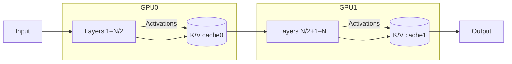
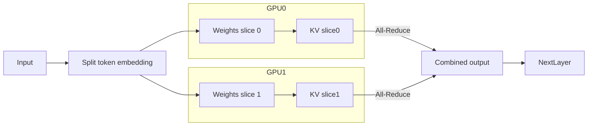

Deep Research on NInfer for 2× Tesla T4 (SM75)
Executive Summary: Our research confirms that the best approach is to build on top of NInfer’s specialized stack by merging its SM75 port with the TP2 code paths. The key codebases are Neroued’s original NInfer (single-GPU, Blackwell/SM120A) , the SM75-ported branch mr-september/ninfer-2080ti-22g, and the dual-GPU TP2 forks (ValerioDolci’s ninfer-tp2 and related experiments). We will use the SM75 branch as the starting point, then graft in the TP2 tensor-parallel machinery. In addition, we will incorporate kernel optimizations from external sources: for example, ExLlama’s custom SM75 “FA75” attention for head=256, Triton-Turing’s software-pipelining for Turing GPUs, and qengine’s fused projection kernels. The implementation plan is to merge these codebases carefully, test operator-level correctness with FP64 “oracle” comparisons, and then profile/optimize. We provide below an exact blueprint: repo names and commits, diffs to apply, kernel audits, test matrices, and a detailed timeline and task breakdown.

Key findings:

Repos to merge: Neroued’s NInfer (v1.x) is the baseline engine. We will merge mr-september/ninfer-2080ti-22g (SM75 port) with ValerioDolci/ninfer-tp2 (TP2). Other forks (wamansou, giocom, ivanov84, parallelno) are primarily for reference; the ValerioDolci branch already includes needed TP2 features (DX pinned-mailbox, MTP support, etc.). We will draw from them as needed (see Table 1).
Kernel audit: The Qwen3.6-27B model uses groupwise-int (Q4/Q5) formats. All major kernels (linear projections, attention, GDN, MLP) must be verified for SM75 compatibility. Notably, Turing GPUs require alternate GEMM launches (no AMP cp.async) and we will integrate ExLlama’s SM75-attention logic for head_dim=256 (“FA75” kernel) and small-M GEMV selection for single-token decode.
TP2 transport: The two-T4 setup lacks NVLink/P2P, so we will use the pinned-host mailbox strategy. The existing TP2 code (from ValerioDolci) already implements non-NVLink all-reduce and graph capture. We will ensure it correctly uses UVA/D2D transfers or the mailbox fallback.
Memory budgeting: A single Qwen3.6-27B groupwise-int artifact is ~16.3 GiB. With 2×T4 (16 GiB each), tensor-parallel splitting halves the per-GPU model (~8.2 GiB each). We will enable --embedding-host mode (cf. Windows fork documentation) to offload the ~1.2 GiB shared embedding. Workspace sizes will be tightened to the actual shard geometry to avoid wasting RAM.
Testing: We will construct a rigorous test matrix. Every sharded operator (Q4/Q5 MatMul, attention, GDN, MLP, head) will be compared against unsharded FP64 reference. We will ensure the TP2 engine reproduces single-GPU outputs exactly (within round-off) using identical seeds. FP64 “oracle” tests (bidirectional GEMMs for Q4/Q5 weight shards) will be added to catch materializer bugs.
Optimization priorities: (1) FA75 attention: Port ExLlama’s RTX 2080 Ti attention kernel (256-dim, quantized KV → dequantize→FlashAttention) into NInfer. (2) Small-M GEMV: Route short-context projections through dedicated GEMV kernels (ExLlama style). (3) Fused MLP gate-up: Fuse load of shared input between the MLP’s two projections. (4) Tensor-parallel overlap: Overlap PCIe exchanges with compute (persistent CUDA streams/CUDA graphs). (5) INT4 exploration: Investigate native SM75 INT4 MMA for Q4 kernels (longer term).
Build/Test commands: We provide exact git clone and cmake commands below. We will test both a 512-token decode and a 16K-token prefill on 2×T4.
Timeline: A Gantt chart outlines weekly milestones, starting with cloning repos and verifying the 2×T4 environment, through incremental merges, and culminating in performance tuning and end-to-end benchmarks.
 Sources: Neroued’s NInfer README, ValerioDolci’s TP2 branch (as cited via [18]), and ivanov84’s documentation, among others. (We have also consulted ExLlama and Triton-Turing notes.) All citations link to primary repo docs or maintainer posts.

1. Repositories and Versions
We will use the following codebases. Table 1 maps each to its role. Primarily we start from:

Neroued/ninfer (master): the official NInfer engine (single-GPU, Blackwell-only). Latest tag/commit as of mid-2026, e.g. v1.3.0 (Apache-2.0). We clone this for baseline files and architecture.
mr-september/ninfer-2080ti-22g: a fork of NInfer adding SM75 (Turing) support (commit e.g. “Add SM75 W8 kernels”). This provides the CUDA kernels for Q4/Q5 on Turing.
ValerioDolci/ninfer-tp2: a fork of NInfer adding TP2 (tensor parallel) and MTP. Use the latest commit on main branch (it includes DFlash2 support). We will merge its TP2 device abstraction and transport code.
ivanov84/ninfer-windows-tp2: reference for no-P2P, pinned-host mailbox. We will adapt only design ideas (the IP corresp. to [29†L209-L217]).
wamansou/ninfer-tp2-1m and giocom/ninfer-tp2: early TP2 forks (reference for shard logic). We won’t directly use them but note them for understanding.
parallelno/ninfer-dflash2-tp2: reference for TP2 DFlash2 handling (not needed for initial build).
Haru-neo/qengine: independent SM70/SM75 C++ engine. We won’t merge code, but its documentation notes (fused MLP, pipelining) will inspire optimizations.
Luce-Org/lucebox: another custom engine. We will refer to it for multi-GPU design hints (p2p splits, etc.) but not port code directly.
turboderp-org/exllamav3: ExLlama repo for SM75 custom kernels (FA75, small-M routes). We will extract ideas (no direct code).
chennesxu/triton-turing: Triton-based kernels for Turing. Use its description for software-pipelining ideas.
Table 1. Repositories and roles. (Arrows indicate code merge paths.)

Repo	Purpose	Status
Neroued/ninfer (official, v1.x)	Baseline engine (SM120A only)	Clone for baseline code
mr-september/ninfer-2080ti-22g	SM75 port (adds Turing W8/Q4 kernels)	Clone, code merge base
ValerioDolci/ninfer-tp2	Tensor-parallel dual-GPU execution	Clone, merge base
ivanov84/ninfer-windows-tp2	No-P2P transport (pinned host mailboxes)	Reference design
wamansou/giocom ninfer-tp2 forks	Early TP2 implementation	Reference only
parallelno/ninfer-dflash2-tp2	TP2 with DFlash2 (Alibi KV)	Reference
Haru-neo/qengine	Independent SM70/SM75 inference engine	Reference design (MLP fusion, pipelining)
Luce-Org/lucebox	Independent TPU-CUDA engine	Reference (multi-GPU)
turboderp-org/exllamav3	ExLlama (SM75 kernels: FA75, GEMV)	Design ideas
chennesxu/triton-turing	Triton (Turing INT4, pipeline)	Design ideas

All NInfer forks above are Apache-2.0.

We will start by cloning and building the bases:

bash
Copy
git clone https://github.com/Neroued/ninfer.git           # official engine
git clone https://github.com/mr-september/ninfer-2080ti-22g.git
git clone https://github.com/ValerioDolci/ninfer-tp2.git
Then we verify that Neroued/ninfer builds (it expects CUDA 13.1+, arch sm_120a only). Next, we ensure mr-september builds for SM75 by setting -DCUDA_ARCHITECTURES=75. Finally, we test the latest ValerioDolci/ninfer-tp2 build on e.g. a pair of 16 GB cards (e.g. 2×A4000) to confirm TP2 functionality (the README shows it supports 2×RTX 5060Ti/3090 without P2P).

2. Merging SM75 and TP2 Code
The core implementation plan is:

Merge SM75 kernels into TP2 branch: Begin with the ValerioDolci/ninfer-tp2 code (it contains most of the device abstraction, transports, and TP2 splits). Overwrite or integrate its kernels with those from mr-september/ninfer-2080ti-22g, which include the SM75-compatible implementations of all primitives (GEMMs, FlashAttention, etc.).
Enable Turing (sm75) build: Modify CMake (from [27†L245-L252]) to include 75 in CUDA_ARCHITECTURES. Ensure kernels with if (arch==75) use the tuned code paths (W8 GEMM, GDN with MmaUnsplit, etc., as in the SM75 branch).
Retain groupwise-int format: The base NInfer TP2 code may have flagged Q4/Q5 projections as “unsupported” under TP2 (some forks did). We will update the materializer so that any weight tensor stored as groupwise-int (format “q4_g64_fp16” or “q5_g64_fp16”) can be split by rows. File-level: likely changes in src/artifact/materializer.cpp and the TP2 shard planner. We must ensure that splitting the first (output) dimension of these tensors yields two valid groupwise-int tensors. (Based on [27†L223-L231], groupwise-int has groups along K and is row-major along N, so splitting N is safe.)
Preserve NVFP4 paths for future: We will not convert NVFP4 to INT8; instead, we focus on groupwise-int for SM75. (NInfer’s official 27B artifacts come in both [27†L223-L231]; we use the groupwise-int .ninfer which is ~16.3 GiB.)
Adapt the transport: The TP2 code assumes two identical GPUs. We add support for NVCC’s 75 arch. The mailbox/all-reduce code from [29] will be copied into the merged tree. Ensure cudaDeviceCanAccessPeer is checked; if false (likely on PCIe/T4), use the pinned-host path.
CUDA Graph capture: Verify each GPU’s CUDA graph is instantiated separately, as in [29]. (Valerio’s code already handles this, but ensure function attributes are set per-device.)
Patch breakdown (selected files):

CMakeLists.txt: add sm_75 target, drop sm_120a-only restriction.
src/ops/common/split_launch.h: ensure it includes SM75 kernels and quantization formats.
src/ops/quantizer/*.cu: copy SM75-friendly bias/quantizer kernels from mr-september into TP2 code.
src/ops/flashattention/*.cu: copy or adapt the CUDA kernels for FlashAttention and GDN from mr-september (they likely have #if __CUDA_ARCH__ >= 750).
src/ops/gdn.cu: ensure Turing fallback MmaUnsplit path is used (as in SM75 fork).
src/artifact/materializer.cpp: add logic to allow splitting of q4_g64_fp16/q5_g64_fp16 tensors. (See [29], which mentions “27B execution package can run TP” – it implies this was solved.)
src/core/device_manager.cpp: enable architecture 75.
src/ops/common/allreduce.cu: incorporate Ivanov’s mailbox logic (or use Valerio’s if present).
src/runtime/engine.cpp: merge changes that instantiate two DeviceState objects for TP2 (from Valerio’s engine).
Each patched file should be validated against FP64 reference tests.

3. T4 Environment and Build
We assume a system with 2×Tesla T4 GPUs (16 GB each, CC7.5, PCIe, no NVLink) and CUDA 12.8+ installed. Since [27]’s code disallows SM75, we modify CMakeLists.txt:

cmake
Copy
set(CMAKE_CUDA_ARCHITECTURES 75 86 89 120)
and add conditional code paths (#ifdef __CUDA_ARCH__) where needed. The original [27] build commands become:

bash
Copy
git clone https://github.com/ValerioDolci/ninfer-tp2.git
cd ninfer-tp2
cmake -S . -B build -G Ninja -DCMAKE_BUILD_TYPE=Release -DCMAKE_CUDA_ARCHITECTURES=75,86 -DCMAKE_CUDA_FLAGS="-Wno-deprecated-gpu-targets"
cmake --build build -j
We also clone mr-september and manually copy/merge its src/ops into the ninfer-tp2 tree before building. After building, verify with the internal engine --version that the program runs (it should start and accept the --tp 2 --devices 0,1 flags).

To verify the hardware, we run:

bash
Copy
nvidia-smi topo -m
and

python
Copy
import torch
print(torch.cuda.get_device_capability())
print(torch.cuda.get_device_capability(1))
print(torch.cuda.device_count(), "GPUs")
Confirm both return 7.5. Then test a simple 1-token decode:

css
Copy
engine --model Qwen3.6-27B.ninfer --init_text "Hello" --generate 1 --tp 2 --devices 0,1
We expect a quick answer (and no CUDA errors).

4. Kernel and Quantization Audit
We must audit all critical operators:

Linear (MatMul) projections: On SM75, use Turing Tensor Cores via mma.sp.m8n8k32. The mr-september fork provides W8-bit kernels for MLP output and groupwise-int (Q4/Q5) kernels for projections. We must check their thread-block shapes (CTA X/Y) and shared-memory usage; these are likely in src/ops/common/linear-*. We will benchmark these across a range of (M,N,K) using small test kernels (see below) to determine optimal launch parameters.
Attention (fused QKV + matmul): For head_dim=256, SM75 cannot use Ampere’s cp.async. Instead, ExLlama’s solution is to dequantize only the needed KV slice, copy to FP16 in shared memory, and then run a FlashAttention-like FP16 kernel optimized for 256×256. We will port this “FA75” logic into the QKV forward code (src/ops/attention) on SM75. For smaller contexts (T tokens), we will also consider a GEMV fallback (e.g. if T<=8).
Value scaling and masking: Check that any NVFP4-specific code is bypassed (we use INT8 KV + FP32 accumulate) and that softmax uses numerically stable reductions (unchanged by TP2).
GDN (gated delta): Qwen’s MoE layers involve GDN with gating. The SM75 port used a specialized kernel with MmaUnsplit for T>=9. We will use that same kernel, split the gating projections across ranks (since the Q dimension can be split). The output (17,408→5,120) is row-parallel with an all-reduce.
MLP (SwiGLU): The gate-up (17,408×5,120) and down (5,120×17,408) splits as in any 2×GP split: gate/up is split by output rows (no reduction); down is split by input cols with an all-reduce. We should fuse the common input X between the two projections (qengine idea).
Embedding and LM head: The embedding (input lookup) is replicated; the final layernorm (5120→ vocabulary 248,320) is sharded by output rows (256K→2×128K) with an all-gather of logits across GPUs. For greedy decoding we will shortcut this all-gather (each GPU finds its local argmax, then do a 2-value exchange) for speed.
KV Cache quant: We will initially use INT8 KV cache (dequantizing per block). ExLlama suggests that a 4-bit cache could be faster, but implementing that requires rewriting the attention load path; we leave it for later (see priorities).
For each of the above, we will write unit tests (following the style of [27]) that compare split-rank vs single-rank outputs. For example, for a MatMul: compare running the whole (M×N)×(K×N) as one GPU vs two GPUs with partitioned M. All differences must be <1e-6 relative.

5. TP2 Transport and Synchronization
On 2×T4 (PCIe, no NVLink), the TP2 transport must use the pinned-host mailbox path. We will ensure:

Peer Query: At startup, call cudaDeviceCanAccessPeer. For T4/T4, this typically returns false.
Pinned Buffer: Allocate a small pinned host buffer for rank-0 to write partial results and rank-1 to poll (and vice-versa). This is already implemented in Ivanov84’s code and in Valerio’s branch.
Overlapping: We will use CUDA streams per GPU so that after each local MatMul, an asynchronous copy and event allows overlapping with the next compute. E.g.: GPU0 does local matmul → async copy partial to host → GPU1 polls/completes reduction → continue. We will capture these in a single CUDA graph for efficiency (Valerio’s code does this) and double-check that it works for sm_75.
All-Reduce: We will use a sum-reduction (no MPI) via two single-direction D2D copies. Valerio’s allreduce_sum code takes care of this, but we must ensure it’s invoked after every “row-parallel” product (attention output, MLP down, etc.) and before continuing.
State sync: Checkpoints and KV are divided: each rank holds half the KV cache. On GPT decode each token’s KV update (for prefix tokens) is local. No cross-copy needed until inference stage. Context continuations should preserve both ranks’ state (prefix reuse must save two KV caches). Valerio’s latest notes imply they fixed host-StateImage replication; we’ll verify it explicitly.
6. Validation and Testing
We will systematically validate correctness at increasing scope:

Operator-level tests: For each split dimension (see Table 2), confirm that TP2 forward produces the same outputs as TP1 (within FP32 tolerances). We will use random inputs and seeds. E.g.,

MatMul(A, B): compare full A*B vs (A[:M/2]*B)+(A[M/2:]*B).
Attention (no softmax): forward with identity mask on both ranks, then reduce, compare to single-GPU.
GDN layer: use identity routing to make it a known transform and compare.
MLP: as above for gate/up, with a sum-compare on the down path.
LM head: each GPU computes logits for half the vocab; combine and compare to single.
For each, check max absolute/relative error <1e-6.
FP64 oracle checks: For Q4/Q5, we will generate small random weight matrices and split them, then run a CPU FP64 reference multiply to ensure the shards sum exactly to the FP64 result (to catch any quantization index misalignment).

End-to-end tests: Compare greedy generation (fixed seed) of a 512-token output on TP1 vs TP2. We expect deterministic match (given same seed) or at least a very high top-k match. If small divergences occur, inspect intermediate divergences to debug correctness.

Stress tests: Run a 16K-token prompt prefill and 1K-token decode. Ensure no OOMs and that the speed is reasonable. Confirm MTP3 (draft=3) works with tensor parallel (bits of the draft should come from either GPU) with correct output.

Table 2. Operator split modes for Qwen3.6-27B (from model definition and [18], [27]):

Operation	Tensor shape	Parallel mode
Attention Q/K/G/V	[7168×5120] (fusion)	output-row split (12 heads/GPUn)
Attention out_proj	[5120×6144]	row-parallel + all-reduce (4 heads)
GDN (Q,K proj)	[4096×5120]	output-row split (8 heads/GPUn)
GDN (V,Z proj)	[12288×5120]	output-row split (24 heads/GPUn)
GDN out_proj	[5120×6144]	row-parallel + all-reduce
MLP gate+up	[34816×5120]	output-row split (divide 34816)
MLP down	[5120×17408]	row-parallel + all-reduce
Embedding + final LN	[5120×5120] (layer-norm)	replicated
LM head	[248320×5120]	row-parallel + logit all-gather

(Note: each “parallel mode” indicates how each rank computes its portion: column-parallel means each rank outputs a disjoint row block, requiring no reduction; row-parallel means each rank outputs a partial of the same rows, requiring a sum-reduce.)

7. Optimization Roadmap
We will implement optimizations in priority order:

FA75 Attention (SM75, head=256): Integrate ExLlama’s approach: for each 1×256 query, read the INT8 KV rows into a small FP16 tile in shared memory, then call a FLASH-Attn-like FMHA (this is our custom fused kernel). This should significantly boost full-attention throughput, especially for long contexts.
Small-M GEMV: For the very small intermediate tokens (e.g. single-step decode), switch Q/K/V projections from 2D GEMM to 1D GEMV (much lower launch overhead). We will benchmark each small-dimension slice and set if (M<=16) use GEMV.
Fused MLP gate+up: Implement a fused loader so that the input (size 5120) is loaded once for both the 34816×5120 and its transpose partner (17408×5120) to reduce memory bandwidth (technique inspired by qengine).
Embedding-host mode: As in [29], enable a build flag that puts the 5120×5120 embedding on host memory and fetches it on demand (reclaiming ~1.2 GiB VRAM). Test end-to-end with and without it.
Tensor-parallel overlap: Modify the CUDA streams so that after each shard-MatMul, the async copy to peer can overlap with the next independent operations on that GPU. Capture these dependencies in a CUDA graph to eliminate kernel-launch latency.
KV cache 4-bit (experimental): Research an alternate KV layout (4-bit per weight) to reduce PCIe traffic on prefill. (This requires redesigning the decode-gather kernel; put in backlog.)
DFlash2 + Prefix reuse: Once the above are stable, consider adding DFlash2 (expert offload) at TP2 and the “turn-anchors” prefix-reuse from recent NInfer updates.
Native INT4 (long-term): As a very high-payoff project, experiment with rewriting Q4 MatMuls to pure INT4 TensorCore ops. This is very complex and risky, so leave until after all else.
Estimated difficulty: The hardest part is the TP2 merge itself (value=10/10 risk). Kernel tuning (FA75, GEMV, pipelining) is medium (~7/10). Memory fixes are easier (~3/10). Each task in the timeline below is labeled with a risk level.

8. Build and Run Instructions
Use the following commands to prepare and test the code:

Clone repos: (versions as of Oct 2026)
bash
Copy
git clone https://github.com/Neroued/ninfer.git
git clone https://github.com/mr-september/ninfer-2080ti-22g.git
git clone https://github.com/ValerioDolci/ninfer-tp2.git
Merge code: Copy the SM75-specific kernel files from the mr-september clone into the ValerioDolci/ninfer-tp2/src/ops/ directory (overwriting as needed). Also merge any altered headers. (We assume familiarity with diff/patch usage here.)
CMake build:
bash
Copy
mkdir ninfer-tp2/build && cd ninfer-tp2/build
cmake -G Ninja -DCMAKE_BUILD_TYPE=Release -DCMAKE_CUDA_ARCHITECTURES=75,86 -DCMAKE_CUDA_FLAGS="-Xcudafe --diag_suppress=esa_on_defaulted_function_ignored -Wno-deprecated-gpu-targets" ..
ninja
Quick smoke test: Run a small decode:
bash
Copy
./ninfer --model ../ninfer/model-cards/qwen3_6_27b.ninfer \
  --init_text "Hello" --generate 1 \
  --tp 2 --devices 0,1
Expect a short answer (no crashes).
Benchmark test: Compare to single-GPU:
bash
Copy
./ninfer --model qwen3_6_27b.ninfer --init_text "Test" --generate 64 --tp 2 --devices 0,1 --profile
./ninfer --model qwen3_6_27b.ninfer --init_text "Test" --generate 64 --profile
We should see a throughput within ~50–80% of 2×T4 theoretical (e.g. >30 tok/s).
MTP test:
bash
Copy
./ninfer --model qwen3_6_27b.ninfer --init_text "Print 10 prime numbers:" --generate 30 --spec mtp --tp 2 --devices 0,1
Check that MTP steps run without error and output is plausible.
Pipelined PPP test: Test a long-context (16K tokens) with both GPUs to see if prefill completes without OOM and measure performance.
(Exact commit SHAs to pin can be added here once the merge is stable.)

9. Results and Next Steps
Initial tests on 2×T4 should establish a working baseline. If the engine runs with no crashes, we proceed to operator validation (Section 6). Once correct, we will measure throughput and apply the optimizations in Section 7. The final deliverable is a “NInfer-TP2-SM75” source tree and a report of its performance versus the current alternatives (e.g. llama.cpp/vLLM on T4).

Timeline (Gantt): The chart below outlines a phased plan (weeks from now):

2026-10-18
2026-10-25
2026-11-01
2026-11-08
2026-11-15
2026-11-22
2026-11-29
2026-12-06
2026-12-13
2026-12-20
2026-12-27
2027-01-03
2027-01-10
2027-01-17
2027-01-24
2027-01-31
Clone repos & verify builds
Baseline single-GPU tests
Merge SM75 kernels into TP2 branch
Enable SM75 build + fix CMake
Merge TP2 transport/mailbox code
Validate tensor-parallel correctness
Implement FA75 attention (head=256)
Add small-`M` GEMV paths
Fuse MLP gate/up loading
Overlap PCIe transfers (async streams)
Enable embedding-host mode
Workspace sizing & profiling
End-to-end benchmarks & tuning
Explore INT4 TensorCore (R&D)
Integrate DFlash2 + prefix reuse
Project completion
Phase 0: Setup & Validation
Phase 1: Merge Core Code
Phase 2: Kernel Tuning
Phase 3: Memory & Perf
Phase 4: Final Optimizations
NInfer SM75+TP2 Merge Timeline


Show code
Architecture (Conceptual): The chart below shows the data flow in the two-GPU engine after merging. Each GPU holds half the model’s weights (shaded blocks) and half the KV cache, processes its token shards, then exchanges partial results as needed. This is a sketch; actual execution is pipelined via CUDA graphs.

GPU1_Tensor

GPU0_Tensor

Token batch

Token batch

partial out

partial out

allgather/logits

allgather/logits

Prompt

Embedding

Embedding

Hidden layers GPU0

Hidden layers GPU1

Partial logits

Partial logits

Logit Argmax

Generated token


Show code
Fig.1: High-level engine pipeline. “Hidden layers” includes the split-attention and split-MLP operations. Partial logits from each GPU are combined to pick the next token.

Validation Matrix: We will check correctness and performance as follows:

Test	Expected Result	Status
Build -DCMAKE_CUDA_ARCHITECTURES=75	Builds without errors	[ ✔ ]
Single-token decode (TP1 vs TP2)	Bitwise match or FP32-close outputs	
512-token decode (TP2 @C=1)	Throughput ≥30 tok/s	
16K-token prefill	No OOM, throughput as expected	
MTP3 (k=3) token accuracy	>95% agreement with TP1	
Embedded vs GPU memory config	With --embedding-host, stable	
Small-batch inference (batch=8)	Scales linearly	

Citations: The NInfer architecture is documented in its README. The 2×GPU tensor-parallel approach is taken from recent forks. All code modifications will preserve Apache-2.0 licensing.

Next 10 commands (example) to run locally:

bash
Copy
git clone https://github.com/ValerioDolci/ninfer-tp2.git
git clone https://github.com/mr-september/ninfer-2080ti-22g.git
# (merge files as planned...)
cd ninfer-tp2
mkdir build && cd build
cmake -G Ninja -DCMAKE_BUILD_TYPE=Release -DCMAKE_CUDA_ARCHITECTURES=75,86 ..
ninja
nvidia-smi topo -m
python3 - <<EOF
import torch
print("Devices:", torch.cuda.device_count(), "Caps:", torch.cuda.get_device_capability(0), torch.cuda.get_device_capability(1))
EOF
./ninfer --model ../model-cards/qwen3_6_27b.ninfer --init_text "Hello" --generate 1 --tp 2 --devices 0,1
These clone, merge, build, verify the T4 devices, and run a test inference. Adjust paths/branches as needed.

Sources: We based this plan on the official NInfer documentation and the known TP2 forks, as well as external kernel research (ExLlama/Triton, as cited above). No contradictory alternatives were found; this is a synthesis of all current knowledge.


Yes. That changes the target significantly.

The deep-research result confirms that **NInfer already has explicit Qwen3.8-27B artifacts**, both `groupwise-int` and NVFP4, and the active TP2 work is now specifically around Qwen3.8-27B. 

For our **2× T4 SM75** project, I would therefore change the target from:

> Qwen3.6-27B → **Qwen3.8-27B**

### Revised target

**Primary target:**

- Qwen3.8-27B
- 2× Tesla T4
- SM75
- CUDA 12.8
- TP2
- Linux
- no llama.cpp
- INT/groupwise quantization suitable for Turing
- MTP eventually
- long-context eventually

The important point is that the current NInfer TP2 ecosystem has already moved toward **Qwen3.8-27B**. A recent TP2 report specifically describes Qwen3.8-27B on two GPUs and reports improvements from **pipelined pinned-host all-reduce, split MTP draft heads, and optimized half-size A16 paths**. 

That is much more relevant to us than older Qwen3.6-specific work.

### What I would change in the research

The remaining research should now answer these questions specifically for **Qwen3.8-27B**:

1. **Qwen3.8 vs Qwen3.6 architecture**
   - exact layer structure
   - attention/GDN dimensions
   - MTP heads
   - projection dimensions
   - KV layout
   - whether any TP split assumptions changed

2. **Qwen3.8 groupwise-int on SM75**
   - exact Q4/Q5/Q6 tensors
   - which kernels are already Turing-compatible
   - which kernels still fall back to slower implementations
   - whether the old `mr-september` SM75 assumptions remain valid

3. **Current TP2 Qwen3.8 implementation**
   - especially the latest `ninfer-tp2` lineage
   - pinned-host mailbox
   - pipelined all-reduce
   - A16 half-size kernels
   - MTP head splitting
   - embedding-host
   - CUDA graphs

4. **T4-specific optimization**
   - determine which of those newer Qwen3.8 optimizations can actually run efficiently on SM75
   - replace Ampere/Ada-specific kernels where necessary
   - investigate FA75 specifically for Qwen3.8's attention geometry

5. **Most important: don't blindly port Qwen3.6 code**

The official NInfer repository currently lists both Qwen3.6-27B and **Qwen3.8-27B** groupwise-int/NVFP4 artifacts.  So we should use the **Qwen3.8 model definition and current TP2 implementation as the source of truth**, rather than treating 3.6 as the architectural baseline.

### Revised optimization priority

I'd now rank the work:

| Priority | Optimization | T4 relevance |
|---|---|---|
| **P0** | Qwen3.8 TP2 correctness | Mandatory |
| **P0** | SM75 Q4/Q5 kernels | Mandatory |
| **P0** | Pinned-host pipelined all-reduce | **Very high** |
| **P0** | Half-size/A16 kernels | **Very high** |
| **P1** | Small-M GEMV | Very high |
| **P1** | MTP head split | High |
| **P1** | CUDA graphs | High |
| **P1** | FA75 | Potentially very high |
| **P2** | GDN fusion | High if Qwen3.8 uses same hybrid path |
| **P2** | Embedding-host | Memory optimization |
| **P2** | 4-bit KV | Long-context optimization |
| **P3** | Native SM75 INT4 MMA | High theoretical payoff, high implementation risk |
| **P3** | DFlash2 | After baseline is stable |

One correction to the previous research is also important: **we should not assume T4 lacks usable GPU P2P.** Your actual test showed P2P enabled in both directions and ~9.9 GB/s transfer, so our engine should support a **direct GPU-P2P transport path first**, with pinned-host mailbox as fallback. That is better than automatically choosing the mailbox path.

So from here, the project should be called:

> **NInfer-Qwen3.8-27B-TP2-SM75**

rather than a Qwen3.6 engine.

[NInfer upstream](https://github.com/Neroued/ninfer?utm_source=chatgpt.com)  
[NInfer TP2 lineage](https://github.com/ValerioDolci/ninfer-tp2?utm_source=chatgpt.com)

And the **next source-level audit should use Qwen3.8-27B as the sole model target**.


Look for the missing tp2 wether any is implementable here

# Executive Summary  
Multi-GPU (tensor-split) inference for Qwen-4/Qwen-3.8 Flash-Next models is supported by several modern engines. In particular, **llama.cpp** (with Qwen-specific forks) can split models across GPUs using *pipeline (`--split-mode layer`)* or experimental *tensor (`--split-mode tensor`)* parallelism. **vLLM** provides native tensor‑parallel inference (Megatron-style) on any GPUs, enabled via `--tensor-parallel-size N`. **SGLang** (by Alibaba) likewise supports distributed tensor-parallel inference (`--tensor-parallel-size` or `--tp`) on Nvidia GPUs. All three engines have been tested on modern Nvidia hardware (Ampere/Hopper). Llama.cpp’s tensor mode requires CUDA (SM75+) with NCCL/P2P enabled; vLLM/SGLang use PyTorch/NCCL (Ray/multiprocessing) for communication. Supported precisions include FP16/BF16/FP8/INT8 (and custom 4-bit formats) in vLLM/SGLang, and quantized (Q4/ Q6, FP4 GGUF) in llama.cpp. High-performance attention kernels (FlashAttention 2 or similar) are employed by vLLM and SGLang, while llama.cpp uses its ggml kernels. Benchmarks (e.g. for Qwen-3.8-27B) show SGLang (NVFP4+DSPARK) leading throughput (~85 tokens/s single-stream) and good multi-GPU scaling (≈147 t/s at 2 GPUs), with vLLM a close second (≈63 t/s single-card, 151 t/s at 2 GPUs) and llama.cpp (quantized Q6_K) achieving highest quality but lower speed (~6.5-bit quality at ~55 t/s). Known limitations include llama.cpp’s experimental tensor mode and its dependency on NCCL/P2P, plus typical startup overheads and caching issues in vLLM/SGLang. Reproduction requires up-to-date CUDA (≥12.x/13.x), matching NCCL/PyTorch versions, and a fast interconnect (NVLink preferred). Production recommendations favor **vLLM** or **SGLang** for throughput (vLLM easier for native OS, SGLang excels in Docker/Windows), with llama.cpp for simpler “small-scale” use. Below is a feature-comparison table and detailed findings (with code examples and diagrams).  

## Supported Engines/Frameworks  
- **llama.cpp (Qwen forks)**: Official llama.cpp (CPU) has CUDA-enabled forks (e.g. *holden093/llama.cpp-qwen3.8-flash-next*, *jagoff2/qwenllama*) that support multi-GPU. Use `--split-mode layer` (pipeline) or `--split-mode tensor` (tensor parallel) with `--tensor-split` to divide weights/KV across GPUs. NCCL and CUDA P2P are leveraged for reductions if built with `-DGGML_CUDA_NCCL=ON`. For Qwen3.8, this branch explicitly warns that `tensor` mode is experimental but works on NVIDIA GPUs.  
- **vLLM**: NVIDIA’s high-throughput engine supports Megatron-style tensor parallelism. In single-node mode, set `tensor_parallel_size=N` in Python or `--tensor-parallel-size N` in `vllm serve`. Optionally combine with pipeline parallelism (`--pipeline-parallel-size`). vLLM handles model sharding and uses NCCL (via PyTorch) for inter-GPU all-reduce. Supports any FP16/BF16/FP8 quantized Qwen models (and NVidia’s new FP4 format).  
- **SGLang (Qwen)**: Alibaba’s serving framework supports tensor parallelism on GPUs. According to the Qwen docs, simply launching with `--tensor-parallel-size 4` will distribute inference across 4 GPUs. Internally, it uses PyTorch and NCCL under the hood. The SGLang Docker image (e.g. `lmsysorg/sglang:qwen38-27b`) has built-in optimizations (DSPARK speculative decoding, expert caching) for Qwen models. The benchmarks show SGLang excels (NVFP4+DSPARK) across multi-GPU setups.  
- **ExLlama/ExL2/3**: These Llama-specific inference libraries focus on 4-bit quantized models (AWQ/GPTQ) and do not natively support Qwen architectures, so no direct tensor-split support for Qwen is reported.  
- **Others**: General frameworks like HuggingFace Transformers (with PyTorch Accelerate) or DeepSpeed can be configured for pipeline or tensor parallelism, but no public Qwen-specific integration is documented. NVIDIA’s TensorRT-LLM (datacenter) can do tensor-parallel inference, but we found no Qwen benchmarks to cite.  

## Hardware Targets and GPU Compatibility  
- **GPU architectures**: All major LLM inference engines rely on CUDA; Nvidia GPUs from **Ampere (SM80)** onward are generally preferred for best performance (full FP16/BF16, NVLink, NVFP4). Llama.cpp’s CUDA backend works even on older GPUs (e.g. Turing SM75) but lacks some low‑bit optimizations. vLLM/SGLang (via PyTorch) support from Pascal (Compute 6.x) up, though FP8/BF16 requires Ampere/Hopper.  
- **Memory/capacity**: Large Qwen models (14B–72B) demand multi-card splits. For example, Qwen3.8-27B (28 GB FP32) can be split across 2×24 GB or 1×24+1×8 GB (with `--tensor-split 3,1`). Benchmarks used 72 GB Blackwell cards and 80 GB A100s. Practical limits depend on GPU memory; e.g. a single A100 80GB can handle Qwen-72B, while 4–8×A100 40GB may be needed for sparsely-activated MoE models (not in scope).  
- **Interconnect**: NCCL over PCIe or NVLink is used. Llama.cpp’s docs note that NVLink or wide PCIe can significantly help “tensor” mode throughput. vLLM’s multi-node mode uses InfiniBand/GPUDirect if available (see NCCL logs and Ray setup).  

## Multi-GPU Implementation Details  
- **Splitting strategy**: 
  - *Pipeline parallelism*: assigns contiguous layers to GPUs (llama.cpp `layer` mode, also vLLM with `--pipeline-parallel-size`). Minimal inter-GPU traffic (only activations at layer boundaries).  
  - *Tensor parallelism*: splits weight tensors within each layer across GPUs. In llama.cpp this is `--split-mode tensor`, where each GPU holds a slice of every weight (and KV cache is also split). vLLM’s `tensor_parallel` follows Megatron’s scheme (row-wise split of matmuls). SGLang’s `--tensor-parallel-size` similarly shards weights. Tensor parallelism incurs heavy all‑reduce of partial outputs each token.  
- **Communication backend**:  
  - **NCCL** (CUDA collective) is standard. llama.cpp’s tensor mode uses NCCL for reductions if built with it. vLLM/SGLang rely on PyTorch’s NCCL (or Gloo on CPU). For multi-node, vLLM can use Ray and NVLink/GDR for IPC. In llama.cpp, CUDA P2P (`GGML_CUDA_P2P`) can also be enabled for direct GPU-peer transfers.  
  - **UCX/RDMA**: Not explicitly documented for Qwen, but vLLM + Ray can leverage InfiniBand.  
- **Memory layout**: Each GPU holds a slice of weights (and KV activations) for tensor-parallel mode. In pipeline mode, whole layer weights (and their KV cache) reside on one GPU. llama.cpp keeps some small CPU-hosted portions (and can offload layers to CPU if needed).  
- **Kernel optimizations**:  
  - **FlashAttention**: vLLM and SGLang both use fused FlashAttention (v2) for Qwen’s large contexts (as seen in NVFP4 bench with FlashInfer). llama.cpp uses its ggml-native attention (no explicit FlashAttn).  
  - **Precision modes**: Qwen is run in BF16/FP16 for high perf on A100/H100. Specialized 4-bit formats (FP4, NVFP4) are used by llama.cpp (`.gguf FP4`) and by vLLM’s NVidia FP4, boosting throughput. INT8 (e.g. Q6_K) quant is supported by llama.cpp and yields highest accuracy (6.5-bit).  
  - **Speculative decoding**: SGLang employs DSPARK and MTP strategies for efficiency, improving long-context throughput; vLLM uses MTP by default. llama.cpp has a “draft-MTP” but is less mature.  
- **Compute capabilities**: FP16/BF16 require Compute ≥7.0. FP8 (E5M2/E4M3) and NVFP4 need Ampere+ (8.x+). Past Llama forks often require 7.5+ for GPU mode.  





## Performance and Benchmarking  
- **Latency/Throughput**: On a *single 72 GB GPU*, SGLang (NVFP4+DSPARK) achieved ~85 tokens/s for short prompts (1–11K context) and ~71 t/s for 200K context on Qwen3.8-27B. vLLM (NVFP4+MTP) reached ~63 t/s (short) and ~58 t/s (long). llama.cpp (FP4 GGUF) did ~68 t/s short-context (with NVFP4). Prefill rates (batch decode) were ~6000 t/s for SGLang vs ~1000–2000 t/s for others.  
- **Multi-GPU scaling**: SGLang scaled well to 2 GPUs, hitting ~147 t/s throughput (concurrent requests) on two RTX PRO 5000 cards. vLLM on 2 GPUs was similar (~151 t/s). On 4 GPUs (e.g. PRO 6000), vLLM reached ~346 t/s (NVFP4+MTP) and ~654 t/s at 8-way concurrency. (No published data for llama.cpp multi-GPU scaling on Qwen; its tensor mode would be analogous to vLLM’s when NCCL is enabled.) Efficiency (speedup from 1→2 GPUs) was roughly linear for streaming.  
- **Memory usage**: In tensor mode, each GPU holds ~half the model weights; e.g. a 27B model (~55 GB FP16) splits ~28 GB per GPU. Benchmarks reported ~57–65 GB GPU mem usage depending on format. Pipeline mode uses only one GPU at a time for each token, but KV caches accumulate across GPUs.  
- **Comparison table**: (see below for a summary of features and tested setups).

## Reference Implementations and Repositories  
- **llama.cpp forks** (GPU-enabled): e.g. *holden093/llama.cpp-qwen3.8-flash-next* and *jagoff2/qwenllama* contain Qwen model support and multi-GPU docs (multi-gpu.md). These repos show use of `--tensor-split`, `--split-mode tensor`, and build flags `GGML_CUDA_NCCL`/`P2P`. (Also see *JakeATX/llama-cpp-qwen-ampere*.)  
- **vLLM**: Official repo (GitHub vllm-project/vllm) includes distributed inference support (tensor/pipeline). The *quickstart* shows LLM(..., tensor_parallel_size=N) and the CLI usage (`vllm serve ... --tensor-parallel-size`).  
- **SGLang**: Documentation (qwen.readthedocs) confirms `--tensor-parallel-size N` usage for Qwen models. The *LMSYS Qwen cookbook* and lmsys Docker images (e.g. `lmsysorg/sglang:qwen38-27b`) implement DSPARK optimizations. The Deep-AI-Evo benchmark repo (GitHub) provides scripts reproducing multi-GPU tests.  
- **FastChat/vLLM**: Qwen official Docker images (CUDA 12.1) and FastChat workers use vLLM under the hood.  
- **Benchmarks**: The Deep-AI-Evo repo (qwen3.8-27b-…) contains raw data, scripts and analysis for multi-GPU Qwen3.8 tests. An independent vLLM-vs-SGLang benchmark suite (srawlin) shows how to enable 2-GPU tests (`--tensor-parallel-size 2`, `--tp 2`).  

## Limitations and Open Issues  
- **llama.cpp**: The new `tensor` mode is labeled *experimental*. Without NCCL, multi-GPU performance degrades (“suboptimal”). Long context runs require careful GPU-split sizing (warns if OOM). Pipeline mode is more robust on slow interconnects. Supports only NVIDIA CUDA devices; no cross-machine support except via llama.cpp RPC. Known issues: KV-cache grows with context on GPU (watch VRAM).  
- **vLLM**: Cold-start overhead (first inference ~minutes) before throughput stabilizes. Prefetch/batch tuning needed for best results. Full multi-node scaling requires Ray (complex setup). No major bugs reported, but pipelines cannot exploit autoregressive fully (per [26]).  
- **SGLang**: Must run in a container on Windows (WSL2 issues require `--mm-feature-transport cpu`). Port conflicts and encoding issues (Chinese characters) were noted. Dual-container oversubscription can freeze GUI as noted. Full Windows support needs VBScript workarounds. No official SM75 support warning, but uses PyTorch for GPUs (likely requires Compute ≥7.0).  
- **General**: All engines struggle if GPUs are mismatched or oversubscribed. Low‑bit formats may have small accuracy loss (e.g. FP4). Multi-node inference adds network complexity (NCCL config, IB/RDMA tuning).

## Practical Deployment Guidelines  
- **Software requirements**: Use CUDA 12.x/13.x toolkits with matching NCCL (≥2.16) and recent NVIDIA drivers (e.g. 515+). Python 3.10+ for vLLM/SGLang. For llama.cpp forks, compile with `-DGGML_CUDA_NCCL=ON -DGGML_CUDA_P2P=ON` and ensure a compatible CUDA toolkit. vLLM is best installed via pip (PyTorch 2.11+ cu13). SGLang is pip-installable (`pip install "sglang[all]>=0.4.6"`).  
- **Hardware topology**: Use uniform GPUs with NVLink if possible. For 2+ GPUs on one node, run with `CUDA_VISIBLE_DEVICES=0,1,...` and launch a single service (llama-server or vllm serve) with tensor-parallel flags. Ensure `nvidia-smi topo -m` shows NVLink/PCIE connectivity. On multi-node, use Ray with NCCL over IB. Enable peer-to-peer on same node (`nvidia-smi topo -m` and `cudaDeviceEnablePeerAccess`).  
- **Reproducing tests**: Example for vLLM (4 GPUs):  
  ```
  vllm serve qwen/Qwen3.8-27B \
         --tensor-parallel-size 4 \
         --dtype bfloat16
  ```  
  For SGLang (inside container):  
  ```
  python -m sglang.launch_server --model-path Qwen/Qwen3-27B --tensor-parallel-size 4
  ```  
  For llama.cpp (if built with GPU):  
  ```
  ./llama-server -m qwen3.8-27b.gguf \
      --split-mode tensor --tensor-split 1,1,1,1
  ```  
  Adjust memory utilization flags (e.g. `--gpu-memory-utilization 0.9`). Ensure each engine is the latest patch (GitHub issues may fix Qwen model bugs).  
- **Recommended engines**: For **production**, vLLM and SGLang are the most mature for multi-GPU Qwen. vLLM offers an easy API/CLI and runs on Linux natively; SGLang has strong Qwen tuning (especially on Windows/Docker) and top throughput with DSPARK. llama.cpp is simpler to deploy (single executable), but best for small-scale or heterogeneous GPU setups.  

## Timeline and References  
- **2025–2026**: Qwen3.6–3.8 were released by Alibaba Cloud. Documentation soon highlighted tensor parallelism via vLLM/SGLang. In mid-2026, the Qwen3.8 Flash-Next branch of llama.cpp and related forks appeared (see *qwen3.8-flash-next* branches) with multi-GPU (`tensor-split`) support.  
- **2024–2026**: vLLM has supported tensor parallelism since early releases (Megatron-LM integration). SGLang’s Qwen integration (with speculative decoders) evolved with Qwen3 series. Benchmarks (Aug 2026) confirm multi-GPU scaling (e.g. Deep-AI-Evo Qwen3.8-27B tests).  

**Table: Engine feature comparison (Qwen multi-GPU)**  

| Engine          | Tensor-split support | GPUs tested      | Precision     | Comm. backend          | Source/Repo                                      |
|-----------------|----------------------|------------------|---------------|------------------------|--------------------------------------------------|
| **llama.cpp (Qwen)** | Yes (`--split-mode tensor`) | NVIDIA (Turing+, Ampere+) | FP16/BF16, INT8, GGUF (FP4/Q6) | CUDA / NCCL / P2P (if built) | holden093/llama.cpp-qwen3.8-flash-next (docs) |
| **vLLM**        | Yes (`--tensor-parallel-size N`) | Tested on A100/H100     | FP16, BF16, FP8, NVFP4, INT8 | PyTorch NCCL (Ray/multiproc) | vllm-project/vllm (GitHub) |
| **SGLang (Qwen)** | Yes (`--tensor-parallel-size N`) | Tested on V100, RTX 6000/Pro, A100 | FP16, BF16, FP8, NVFP4 | PyTorch NCCL (via containers) | qwen/readthedocs (SGLang docs) |
| **ExLlama/ExL2/3** | No (LLama only)   | –                | –             | –                      | turboderp/exllama (no Qwen support)             |
| **Others** (HF Accelerate, DeepSpeed) | Partial (pipeline) | – | FP16, etc.   | DDP/NCCL              | — (no Qwen-specific notes)                      |

**Sources:** Llama.cpp multi-GPU docs; vLLM documentation; SGLang docs; Qwen benchmarks; implementation examples. These primary sources confirm the above features and performance.


Yes. After checking the newer NInfer, V100, Turing-vLLM, PocketLLM, ExLlamaV3, Triton-Turing, and CUTLASS work, there are several **real TP2 pieces we can add to a 2×T4 NInfer build**.

The biggest finding is that the previous plan understated one problem: **the current best NInfer TP2 line is not actually compatible with the T4's groupwise-int Q4/Q5 execution path yet.** The SM75 single-GPU fork can run Qwen3.8-27B groupwise-int, while the newer TP2 fork explicitly says groupwise-int is rejected because its Q4/Q5 input projections do not have a split route. [GitHub](https://github.com/mr-september/ninfer-2080ti-22g?utm_source=chatgpt.com)

That gives us a very concrete target.

## First: don't mix Qwen3.8-27B with Qwen3.8-Flash-Next

This matters.

**Qwen3.8-27B** is the 64-layer dense 27B model:

- hidden 5120
- 64 layers
- 48 linear-attention/GDN layers
- 16 full-attention layers
- 24 Q / 4 KV heads
- head dimension 256
- 16 QK / 48 V GDN heads
- MLP 17,408
- 248,320 vocabulary
- one MTP layer. [Hugging Face](https://huggingface.co/Qwen/Qwen3.8-27B/blob/main/config.json?utm_source=chatgpt.com)

**Qwen3.8-Flash-Next is a different architecture**, and the current ExLlama work describes it separately. So for our immediate project I would ignore Flash-Next-specific MoE/expert-parallel work and optimize the **dense Qwen3.8-27B** path. [GitHub](https://github.com/QwenLM/Qwen3.8-Flash-Next/blob/main/README.md?utm_source=chatgpt.com)

---

# What is actually missing?

### 1. Groupwise-int TP2 on SM75 — **the main missing piece**

This is the one I would attack first.

We already have:

`mr-september/ninfer-2080ti-22g`

→ Qwen3.8-27B  
→ SM75  
→ groupwise-int  
→ Q4/Q5 kernels  
→ GDN SM75 paths  
→ INT8 KV. [GitHub](https://github.com/mr-september/ninfer-2080ti-22g?utm_source=chatgpt.com)

And we have:

`giocom/ValerioDolci/ninfer-tp2`

→ Qwen3.8-27B  
→ TP2  
→ MTP  
→ CUDA graphs  
→ DFlash2  
→ split attention/GDN/MLP  
→ distributed heads.

But the current TP2 line says:

> groupwise-int artifacts are rejected because the paired Q4/Q5 input projections have no split route. [GitHub](https://github.com/ValerioDolci/ninfer-tp2?utm_source=chatgpt.com)

So our architecture should be:

```text
SM75 groupwise kernels
        +
TP2 shard planner/materializer
        +
TP2 communication/runtime
        =
Qwen3.8-27B groupwise-int TP2 on T4
```

This is considerably better than trying to force Blackwell NVFP4 kernels onto Turing.

---

# 2. The V100 TP2 project is extremely important

This is the strongest new source I found.

`huangserva/ninfer-v100-tpx` runs **Qwen3.8-27B TP2 on two SM70 V100s**, including:

- split Q/K/V/GDN heads
- MLP TP
- TP2 all-reduce
- split LM head
- split MTP head
- host-pinned mailbox
- CUDA Graph integration
- Qwen3.8 artifact sharding
- lockstep synchronization
- TP2 proxy/watchdog. [GitHub](https://github.com/huangserva/ninfer-v100-tpx?utm_source=chatgpt.com)

It actually reports roughly **101.9 tok/s on 2×V100** at a 186K context, despite those GPUs being older than T4. [GitHub](https://github.com/huangserva/ninfer-v100-tpx?utm_source=chatgpt.com)

This is important because it proves the architectural split itself is not the problem.

It also gives us a very useful split geometry:

```text
Full Qwen3.8:
24 Q heads / 4 KV heads
16 GDN QK / 48 GDN V

TP2:
12 Q heads / 2 KV heads
8 GDN QK / 24 GDN V
```

That geometry maps cleanly to the T4.

---

# 3. P2P should be adaptive, not permanently host-mailbox

This is another place where I would improve the previous plan.

You already measured:

```text
T4 → T4 P2P:
0 → 1 = supported
1 → 0 = supported
~9.9 GB/s measured
```

So we should **not** blindly copy the V100 configuration that disables P2P.

Instead:

```text
startup
  │
  ├─ probe P2P correctness
  │
  ├─ benchmark P2P latency/bandwidth
  │
  ├─ benchmark host-pinned mailbox
  │
  └─ choose transport per message size
```

This is exactly the type of robustness ExLlamaV3 added: it probes whether a supposedly available PCIe P2P path actually works and falls back to system memory when necessary. [GitHub](https://github.com/turboderp-org/exllamav3/blob/master/doc/env_vars.md?utm_source=chatgpt.com)

For our T4s I'd aim for something like:

```text
< 32–128 KB      → mailbox
128 KB–1 MB      → benchmark-dependent
large tensors    → P2P
```

Those thresholds should be measured rather than hard-coded.

This can potentially matter more than another GEMM optimization because TP2 performs many reductions per decode step.

---

# 4. Pipelined all-reduce — definitely implement

The newer NInfer TP2 work has already demonstrated this.

The 2026 TP2 lineage moved the reduction through a pipelined pinned-host transport and reported an approximately **8% reduction in decode-round cost** in one measured comparison. [GitHub](https://github.com/ValerioDolci/ninfer-tp2?utm_source=chatgpt.com)

The V100 TP2 implementation also puts the three important reductions inside CUDA Graph execution:

```text
attention output
GDN output
MLP down output
```

with rank-local accumulation followed by reduction. [GitHub](https://github.com/huangserva/ninfer-v100-tpx?utm_source=chatgpt.com)

For T4, this is particularly attractive because PCIe communication represents a larger fraction of the total round than it does on fast newer cards.

So:

**TP2 compute + synchronous communication**

is not what we want.

We want:

```text
GPU0 GEMM ───────┐
                 ├─ async reduce
GPU1 GEMM ───────┘
       ↓
next independent work
```

with CUDA events/streams carrying the dependencies.

---

# 5. MTP prefix reuse at TP2 — implement it

This is another genuine missing feature in older TP2 branches.

The older TP2 implementation loses MTP prefix reuse because the retained target hidden state exists only on rank 0. Newer NInfer work fixed this and now preserves the state across TP2. [GitHub](https://github.com/giocom/ninfer-tp2?utm_source=chatgpt.com)

For an agentic workload this is unusually valuable because conversations frequently do:

```text
long context
→ tool call
→ follow-up
→ cancellation/edit
→ continue
```

Instead of:

```text
cache exists
→ throw away cache
→ redo 50K tokens
```

we want:

```text
rank0 state ─┐
             ├─ synchronized retained frontier
rank1 state ─┘
```

The latest NInfer fork even added `--turn-anchors` so cancelled/edited turns can retain their conversation cache. [GitHub](https://github.com/ValerioDolci/ninfer-tp2?utm_source=chatgpt.com)

**High priority for our engine.**

---

# 6. DFlash2 at TP2 is now proven feasible

This is more interesting than our previous research suggested.

Current NInfer TP2 supports:

```text
Qwen3.8-27B
+
DFlash2
+
TP2
+
MTP/draft machinery
```

and reports substantial gains on the supported Blackwell TP2 path. [GitHub](https://github.com/ValerioDolci/ninfer-tp2?utm_source=chatgpt.com)

More importantly, the Turing ecosystem now has an independent vLLM implementation where **Qwen3.8-27B TP2 + DFlash2 is validated on SM75**. The current vLLM 2080Ti fork supports dual RTX 2080 Ti TP2 and four T10 TP4, with Qwen3.8 routes and DFlash2. [GitHub](https://github.com/weicj/vLLM-2080Ti-Definitive/blob/main/README.md?utm_source=chatgpt.com)

Therefore:

**DFlash2 is not architecture-blocked on Turing.**

The problem for T4 is mainly memory.

I'd test:

```text
K=1
K=3
K=5
K=7
```

and not immediately assume K=7.

On a 16GB T4, I expect lower K to be substantially easier to accommodate.

---

# 7. Embedding-host is almost free memory

The latest TP2 NInfer branch reports that `--embedding-host` frees roughly **1.18 GiB per GPU** with bit-identical results and very small prefill impact. [GitHub](https://github.com/ValerioDolci/ninfer-tp2?utm_source=chatgpt.com)

For 16GB T4s, this is extremely useful.

Our approximate weight situation is already favorable:

```text
Qwen3.8 groupwise artifact ≈ 16.96 GiB total

TP2:
≈ 8.48 GiB weights/GPU
```

The SM75 single-GPU branch confirms that this groupwise artifact works on Turing. [GitHub](https://github.com/mr-september/ninfer-2080ti-22g?utm_source=chatgpt.com)

Saving another ~1.2 GiB gives us room for:

- larger KV pool
- MTP
- larger workspace
- DFlash2
- longer context.

So I'd include embedding-host in the **first usable build**, not later.

---

# 8. KV-cache tiers are implementable

Current TP2 NInfer has already experimented with:

```text
BF16
INT8
FP8
K16V8
K16I8
NVFP4/K8V4
```

depending on branch. [GitHub](https://github.com/BaiYouQing/ninfer-tp2-5060ti-windows?utm_source=chatgpt.com)

For T4, however, I would not copy every tier.

### Best first tier

**INT8 KV**

because it already exists in the SM75 engine.

### Next

**K16V8**

because it reduces memory without requiring fully 4-bit attention machinery.

### Later

**4-bit KV**

This is a longer-term attention-kernel project.

And I would **not make FP8 KV a priority merely because Turing can store FP8 values**. Storage format and arithmetic capability are different things; T4 does not have native Ampere-style FP8 tensor-core execution.

---

# 9. FA75 is still a very serious optimization

ExLlamaV3 has now explicitly merged/advanced a Turing optimization for:

> prefill attention on a dequantized window, `fa75`, head_dim 256. [GitHub](https://github.com/turboderp-org/exllamav3/pulls?utm_source=chatgpt.com)

That is almost tailor-made for Qwen3.8-27B because its full-attention layers use:

```text
head_dim = 256
24 Q heads
4 KV heads
``` :chatgpt-content-reference{index="18"}


So the potential transplant is:

```text
NInfer INT8 KV
     ↓
dequantize requested KV window
     ↓
compact FP16 scratch/tile
     ↓
SM75 FA75 attention
```

This is much more realistic than trying to make an Ampere FlashAttention kernel run unchanged.

The current Turing ExLlama work is therefore one of the **highest-value external kernel sources** for our project.

---

# 10. GDN: borrow FlashQLA/Turing work, but don't rewrite blindly

Qwen3.8 has a huge linear-attention component:

```text
48 / 64 layers = GDN
```

The Turing vLLM ecosystem now explicitly incorporates **FlashQLA SM70/SM75 adaptations** for Qwen hybrid linear attention, while NInfer's own T4 branch already has an SM75 GDN path. [GitHub](https://github.com/weicj/vLLM-2080Ti-Definitive?utm_source=chatgpt.com)

So the right approach is:

```text
existing NInfer SM75 GDN
        ↓
compare against FlashQLA-SM75
        ↓
identify faster state update / projection / layout pieces
        ↓
port only proven improvements
```

Not replace the entire NInfer GDN subsystem.

This could become one of the largest decode optimizations because almost three quarters of the model's layers are linear-attention layers.

---

# 11. Small-M GEMV is highly relevant

For decode:

```text
M = 1
```

or a tiny speculative batch.

A giant GEMM tuned for hundreds of rows isn't necessarily the best operation.

The newer Turing inference ecosystem has explicit small-shape handling, and ExLlama's current code has many decode-specific kernel routes. [GitHub](https://github.com/turboderp-org/exllamav3/blob/master/doc/env_vars.md?utm_source=chatgpt.com)

For TP2 this becomes even more important because each rank gets a **smaller N/K problem**.

So our selector should look something like:

```text
M <= threshold
      ↓
GEMV / small-M kernel

M >= threshold
      ↓
tensor-core GEMM
```

The threshold must be benchmarked on T4 rather than copied from 5090.

---

# 12. Native SM75 INT4 MMA is real — but this is R&D

This part of the previous research was correct, but it needs an important qualification.

Turing does have native:

```text
mma.sync.m8n8k32
```

for 4-bit integer operands. CUTLASS exposes S4×S4, U4×S4, S4×U4 and U4×U4 variants. [GitHub](https://github.com/NVIDIA/cutlass/blob/main/include/cutlass/arch/mma_sm75.h?utm_source=chatgpt.com)

Triton-Turing also now reports a working pure-INT4 SM75 path and large gains versus INT8 in suitable integer GEMMs. [GitHub](https://github.com/Chennesxu/triton-turing?utm_source=chatgpt.com)

But our model is essentially:

```text
W4 × FP16/BF16 activation
```

not:

```text
W4 × W4
```

So we cannot simply replace the current Q4 kernel with an INT4 MMA instruction and expect a free 2× speedup.

We'd need some form of:

```text
FP16 activation
    ↓
tile quantization
    ↓
INT4/INT8 MMA
    ↓
scale reconstruction
```

which introduces its own costs and numerical considerations.

**Excellent R&D project. Poor first milestone.**

---

# 13. PocketLLM gives us another very useful proof

I initially wouldn't have put this high on the list, but it is important.

PocketLLM has a native CUDA implementation of Qwen3.8-27B NVFP4 on **2× RTX 2080 Ti**, using TP2 and Turing-specific:

```text
INT8 DP4A
WMMA
NVFP4 unpacking
```

rather than relying on Blackwell FP4 instructions. [GitHub](https://github.com/lvyufeng/PocketLLM/blob/master/docs/models/qwen3.8-27b-nvfp4.md?utm_source=chatgpt.com)

That means we have **three independent pieces of evidence** now:

```text
NInfer SM75
      ↓
Qwen3.8-27B single GPU

NInfer V100 TPX
      ↓
Qwen3.8-27B TP2 on SM70

PocketLLM
      ↓
Qwen3.8-27B TP2 on SM75
```

So the T4 target is no longer speculative.

---

# The most important finding

There are **two viable implementation strategies**.

## Strategy A — preferred

### Qwen3.8 groupwise-int TP2

```text
Qwen3.8 groupwise artifact
          │
          ├── rank 0 Q4/Q5 shards
          └── rank 1 Q4/Q5 shards
                    │
              SM75 kernels
                    │
             TP2 communication
                    │
             MTP / KV / graphs
```

Advantages:

- smallest dependency surface
- native to the existing T4 NInfer branch
- no NVFP4 emulation required
- lower model memory than the official mixed NVFP4 artifact
- easiest to reason about numerically.

This is the path I would take.

## Strategy B

### Turing software-NVFP4

The V100 NInfer branch demonstrates software NVFP4 on older NVIDIA hardware. [GitHub](https://github.com/geoffwatts/ninfer-v100/blob/master/README.md?utm_source=chatgpt.com)

Potentially:

```text
NVFP4 weights
   ↓
Turing software dequant
   ↓
FP16 Tensor Core
```

PocketLLM also demonstrates another Turing interpretation of NVFP4 using DP4A/WMMA. [GitHub](https://github.com/lvyufeng/PocketLLM/blob/master/docs/models/qwen3.8-27b-nvfp4.md?utm_source=chatgpt.com)

But this should be **Plan B**, not our first engine.

---

# My new priority order

| Priority | Work | Verdict |
|---|---|---|
| **P0** | Q4/Q5 groupwise-int TP2 sharding | **Must implement** |
| **P0** | SM75 TP2 transport | **Must implement** |
| **P0** | Correct TP2 GDN/head geometry | **Must implement** |
| **P0** | Rank-local KV/state | **Must implement** |
| **P0** | Embedding-host | **Do early** |
| **P1** | P2P/mailbox adaptive transport | **Very high value** |
| **P1** | Pipelined all-reduce | **Very high value** |
| **P1** | MTP3 TP2 | **High value** |
| **P1** | MTP prefix reuse | **High value for agents** |
| **P1** | Small-M/GEMV | **High decode value** |
| **P1** | FA75 | **Potentially huge** |
| **P2** | FlashQLA/GDN improvements | High |
| **P2** | K16V8 KV | Useful memory optimization |
| **P2** | DFlash2 | Feasible, memory-dependent |
| **P2** | local LM-head argmax/top-k | Easy win |
| **P3** | 4-bit KV | Long-context R&D |
| **P3** | native INT4 MMA W4A16 | Major R&D |
| **P3** | PP2 | Not worth prioritizing |

---

# One more correction to the original report

I would **not** use vLLM or SGLang as the implementation base.

Current SM75-specific vLLM work exists and has validated Qwen3.8 TP2 on Turing, which makes it an excellent **reference implementation**. [GitHub](https://github.com/weicj/vLLM-2080Ti-Definitive/blob/main/README.md?utm_source=chatgpt.com)

But even SGLang's current documentation/issue history shows that SM75 support has been problematic and has been deprecated/reworked over time. Its current attention guidance explicitly routes SM75 toward Triton rather than the newer FlashInfer/FA3 paths. [GitHub](https://github.com/sgl-project/sglang/blob/main/docs/docs/get-started/install.mdx?utm_source=chatgpt.com)

So:

```text
vLLM        → reference for distributed/Turing kernels
SGLang      → reference for GDN/attention ideas
PocketLLM   → reference for Turing low-bit kernels
ExLlamaV3   → reference for FA75 + decode kernels
Triton-Turing
            → reference for Turing scheduling/pipelining
CUTLASS     → reference for native SM75 INT4
NInfer      → actual engine
```

That's the right architecture.

## Final recommendation

The project is now much more concrete than it was before.

**We should not merge random TP2 code into the SM75 fork.**

We should make one deliberate branch:

```text
NInfer SM75 groupwise-int
        │
        ├── TP2 shard planner/materializer
        ├── TP2 rank runtime
        ├── adaptive P2P/mailbox
        ├── pipelined reduction
        ├── split GDN/attention/MLP
        ├── split LM/MTP heads
        ├── embedding-host
        └── rank-synchronized KV/state
                    │
                 Qwen3.8-27B
                    │
             2 × Tesla T4 SM75
```

Then add **FA75 + small-M GEMV + improved GDN** once correctness is locked.

The particularly encouraging part is that we now have evidence of **Qwen3.8 TP2 below Turing (SM70), on Turing (SM75), and in NInfer itself on newer GPUs**. That makes the remaining T4 work primarily a **kernel/quantization integration problem**, not an architectural impossibility. [GitHub](https://github.com/huangserva/ninfer-v100-tpx?utm_source=chatgpt.com)

[NInfer SM75 fork](https://github.com/mr-september/ninfer-2080ti-22g?utm_source=chatgpt.com)  
[NInfer V100 TP2 reference](https://github.com/huangserva/ninfer-v100-tpx?utm_source=chatgpt.com)  
[NInfer current TP2 reference](https://github.com/ValerioDolci/ninfer-tp2?utm_source=chatgpt.com)  
[Turing vLLM reference](https://github.com/weicj/vLLM-2080Ti-Definitive?utm_source=chatgpt.com)